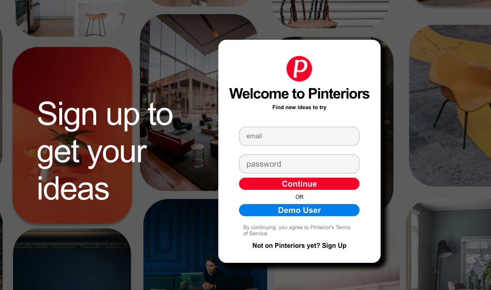
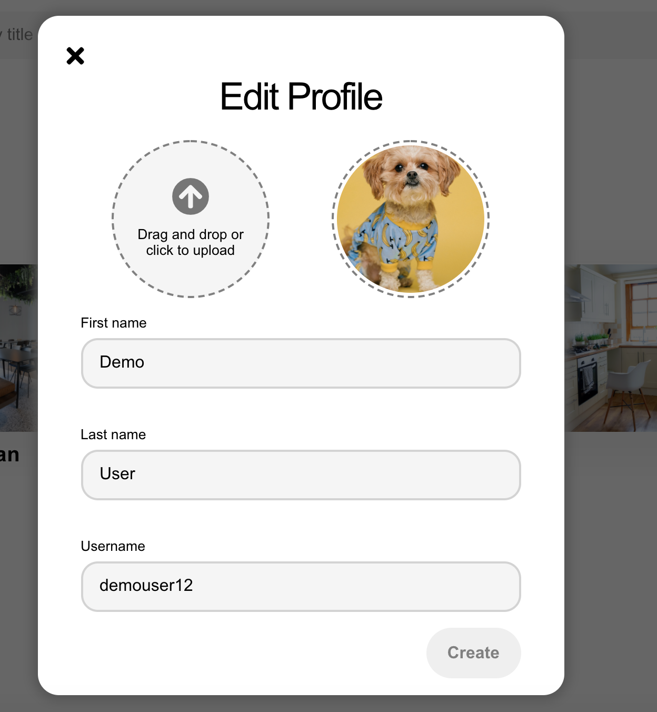
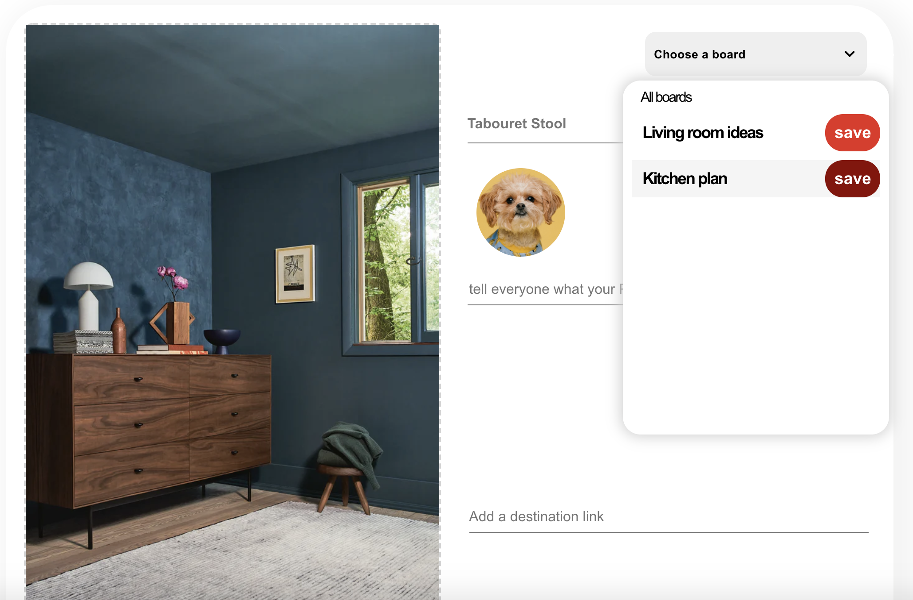

# README

<h1><a href='https://pinteriors.herokuapp.com/#/' target='_blank'>Welcome to Pinteriors!</a></h1>
Pinteriors is a <a href='https://www.pinterest.com' target='_blank'>Pinterest</a> clone built specifically with interior designers in mind. You can use it as a digital pinboard to keep track of your photos and design ideas. The site is built with a Ruby on Rails backend, with PostgreSQL and AWS S3 for data storage and React/Redux on the frontend along with HTML/CSS. The app is deployed using Heroku.  
  

<h1>Features</h1>
* User Authentication (signup, login, logout) with secure password hashing

* Logged in users can:
    * browse the home feed
    * naviagate to specific pin images
    * pin that image to one of their existing boards 
    * view their profile page which includes a preview of the top three pins on their current boards
    * edit their profile information and avatar photo
    * 
    * open a modal to create a new board 
    * view a current board and its associated pins
    * search for a pin by title
    * upload new images as pins
    * 
    * delete pins that they own

<h1>Technology</h1>
This is a fullstack web application that was built with 

* React / Redux
* JavaScript
* HTML / CSS
* Ruby on Rails
* PostgreSQL
* AWS S3
* Jbuilder

