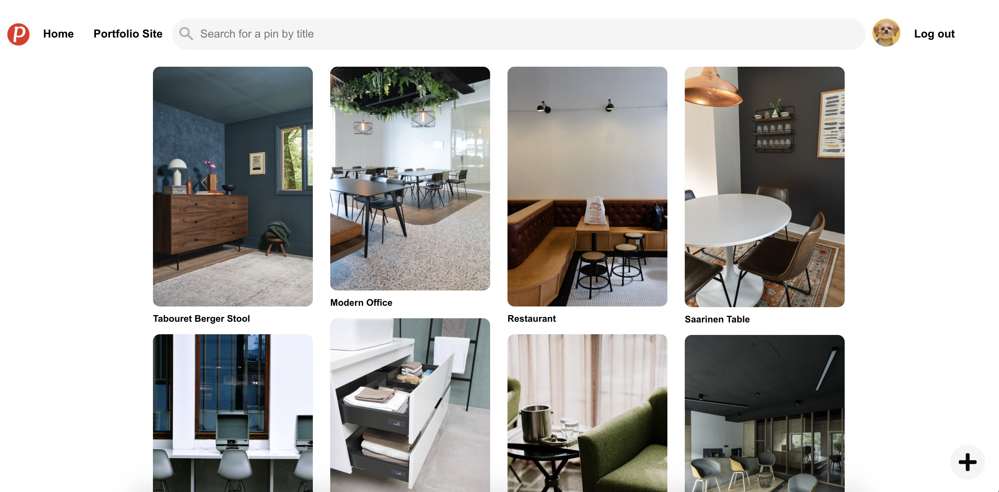
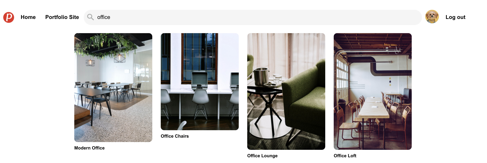

# README

<h1><a href='https://pinteriors.herokuapp.com/#/' target='_blank'>Welcome to Pinteriors :pushpin:</a></h1>
Pinteriors is a <a href='https://www.pinterest.com' target='_blank'>Pinterest</a> clone built specifically with interior designers in mind. You can use it as a digital pinboard to keep track of your photos and design ideas. The site is built with Ruby on Rails on the backend, with PostgreSQL and AWS S3 for data storage and React/Redux on the frontend along with HTML/CSS. The app is deployed using Heroku.  
  

  

<h1>Features</h1>
* User Authentication (signup, login, logout) with secure password hashing

* Logged in users can:
    * Browse the home feed
      * 
    * Naviagate to specific pin images
    * Pin that image to one of their existing boards 
    * View their profile page which includes a preview of the top three pins on their current boards
      * 
    * Edit their profile information and avatar photo
      * 
    * Open a modal to create a new board 
    * View a current board and its associated pins
    * Search for a pin by title
      * 
    * Upload new images as pins
      * 
    * Delete pins that they own

<h1>Technology</h1>
This is a fullstack web application that was built with 

* React / Redux
* JavaScript
* HTML / CSS
* Ruby on Rails
* PostgreSQL
* AWS S3
* Jbuilder

<h1>Coming Soon..</h1>

I love working on this site and there is always something more to add. I am planning on adding the following features: 

* Homepage with rotating image transitions
* More robust backend search functionality
* Edit pins & boards
* Follow users
* Like/Comment on followed users' pins
* Secret boards

